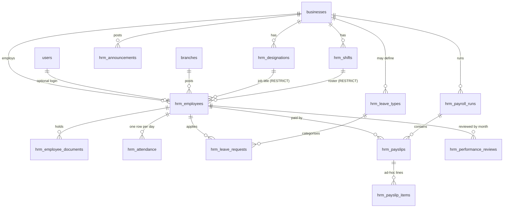

# HRM module

Human Resource Management for the POS backend: employees, designations, shifts,
attendance, leave, payroll, performance, announcements, reports, audit logs and
settings.

The module is additive. It adds twelve `hrm_`-prefixed tables, two permissions,
and one route group under `/hrm`. It alters no existing table, changes no
existing endpoint, and touches the POS code only where a new module has to be
wired in: `routes.Handlers`, the DI container, and the route registration.

---

## How it fits the existing architecture

Same five layers as the rest of the backend, in the same directories, with the
same rules:

| Layer | Where | HRM files |
|---|---|---|
| Entity | `internal/entity/` | `hrm_organization.go`, `hrm_employee.go`, `hrm_attendance.go`, `hrm_leave.go`, `hrm_payroll.go`, `hrm_performance.go` |
| Repository | `internal/repository/` | `hrm_*_repository.go`, plus `setting_repository.go` and `audit_log_query_repository.go` |
| Service | `internal/service/` | `hrm_*_service.go`, `hrm_query.go`, `authorization_service.go` |
| Mapper | `internal/mapper/` | `hrm_*_mapper.go` |
| Handler | `internal/handler/` | `hrm_*_handler.go`, `hrm_helpers.go` |
| Routes | `internal/routes/` | `hrm_routes.go` |
| Migrations | `database/migrations/` | `00016_hrm.sql`, `00017_seed_hrm_permissions.sql` |

The layering rules the linter enforces (`.golangci.yml` depguard) hold
throughout: handlers never import `internal/repository` or `gorm`, repositories
never import `internal/dto` or `fiber`, services never import `fiber`. That is
why the services take their own query types (`service.EmployeeQuery`,
`service.DateWindow` — `internal/service/hrm_query.go`) rather than the
repository's params, exactly as `OrderService` declares `OrderListQuery`.

### What is reused rather than rebuilt

| Concern | Reused |
|---|---|
| Tenancy | `business_id` on every table, taken from the token, never from a body |
| Auth | The existing JWT middleware. HRM adds no login path of its own |
| Staff logins | `users` + `user_roles` via `UserRepository`; an employee's optional account is an ordinary user row, hashed with the same `pkg/hash` and the same `BCRYPT_COST` |
| Errors | `pkg/apperror` codes → the single `{"message": "..."}` shape |
| Pagination + sort safety | `pkg/pagination`, with a per-endpoint sort whitelist |
| Search escaping | `pkg/strutil.EscapeLike`, applied by `pagination.Parse` |
| Transactions | `repository.TxManager`, with per-transaction repositories the way `AuthService` does it |
| Audit | The existing `audit_logs` table and the async `AuditWorker` |
| Settings | The existing `settings` table, under three reserved keys |
| Validation | `internal/validator` struct tags, including the custom `bcryptsafe` rule |

Two things are new because nothing equivalent existed:

- **`AuthorizationService`** (`internal/service/authorization_service.go`) —
  resolves a user's effective permissions from their roles, behind a TTL cache
  bounded by `AUTH_PERMISSION_CACHE_TTL`.
- **`middleware.RequirePermission`** — the route gate built on it.

Permissions are resolved per request rather than carried in the access token.
The token lives 12 hours, so a permission baked into a claim would survive a
revocation for the rest of a shift.

---

## Data model



### Tables

| Table | Key constraint | Why it matters |
|---|---|---|
| `hrm_designations` | unique `(business_id, lower(name))` where not deleted | Renaming a title reaches every payroll at once |
| `hrm_shifts` | `weekly_off` JSONB of weekday numbers 0–6 | `end_time <= start_time` means the shift crosses midnight |
| `hrm_employees` | unique `(business_id, employee_code)`, `(business_id, upper(nic))`, `(business_id, lower(email))`, `(user_id)` | All partial (`WHERE deleted_at IS NULL`), so deleting frees the natural key |
| `hrm_employee_documents` | FK cascade from the employee | Child table, not a JSONB column: documents are added and removed one at a time and each is a data URL |
| `hrm_attendance` | unique `(employee_id, work_date)` | This is what makes clock-in idempotent — a double tap cannot create a second half-day |
| `hrm_leave_types` | unique over `COALESCE(business_id, '000…')` + `upper(code)` | `business_id NULL` = a system type shared by every tenant, the same pattern `roles` uses |
| `hrm_leave_requests` | `end_date >= start_date` CHECK | `days` is stored, not derived — see below |
| `hrm_payroll_runs` | unique `(business_id, period_year, period_month)` | `rules` is a JSONB snapshot of the settings the run used |
| `hrm_payslips` | unique `(payroll_run_id, employee_id)`; `net_cents >= 0` | Period denormalised from the run so reports filter without a join |
| `hrm_payslip_items` | `kind IN ('earning','deduction')` | Lets a payslip print its own breakdown |
| `hrm_performance_reviews` | unique `(employee_id, period_year, period_month)` | A second save edits the review rather than adding one, or an average rating would depend on how often the form was saved |
| `hrm_announcements` | `expires_on >= publish_date` CHECK | Calendar days, not timestamps |

Conventions carried over from the POS schema: application-minted UUIDv7 primary
keys (no `AutoMigrate`, ever), money as `BIGINT` integer cents, `DATE` for
calendar days and `TIME` for clock times, `set_updated_at()` triggers, and soft
delete on the master data a historical row still has to resolve.

### Indexes

Every foreign key used as a filter is indexed, plus the compounds the actual
queries sort on: `(business_id, status)`, `(business_id, full_name)`,
`(business_id, work_date DESC)`, `(employee_id, leave_type_id, status)` for the
balance query, and `(employee_id, period_year DESC, period_month DESC)` for
payslip history.

---

## Domain rules worth knowing

**Employee codes** are allocated server-side, sequentially per business, from
1001. `NextEmployeeCode` takes a transaction-scoped Postgres advisory lock so
two simultaneous hires cannot both read the same maximum. Soft-deleted rows are
included in the maximum: reissuing a departed employee's code would make two
people share an identifier across payroll history.

**Employee logins** are optional and are ordinary `users` rows. The login
identifier is the **email address** — there is no separate username column, and
adding one would give the system a second sign-in path the auth module knows
nothing about. Creating an employee with a login is one transaction, so a hire
that fails partway cannot leave behind an account with a password somebody has
already been told. Deleting an employee does **not** delete their login: losing
an HR file must not silently lock somebody out of the till.

**Attendance** stores its derived minute columns rather than recomputing them.
Payroll reads a month for every employee at once, and re-deriving shift
arithmetic per row would make a payroll run scale with history rather than with
headcount. Clock-out looks up the day of the clock-**in**, so a night shift
punched in at 22:00 and out at 06:00 stays one day's work. On a rostered day off
the shift schedules nothing, so every worked minute is overtime.

**Leave** stores `days` at request time, counted against the roster the employee
held then. Recomputing it at approval — after a shift change — would silently
rewrite how much leave somebody had asked for. Balances are derived from the
approved requests rather than stored, so the two cannot drift. Approving a
request also writes `on_leave` rows onto the register for days that do not
already have one; that write is best-effort, because payroll reads leave from
the requests themselves.

**Payroll** computes, per employee:

```
daily rate  = basic / working_days_per_month
hourly rate = basic / (working_days_per_month * working_hours_per_day)
overtime    = hourly rate / 60 * overtime_minutes * multiplier
absence     = daily rate * (unexcused absences + unpaid leave days)
gross       = basic + overtime + bonus + allowances
statutory   = EPF employee share + ETF + tax, all assessed on the basic salary
net         = max(0, gross - absence - statutory - other deductions)
```

EPF and ETF are on the basic salary, not on gross: overtime and a festival bonus
are not pensionable pay. The employer's EPF share and the ETF contribution are
recorded on the payslip for the employer's returns and are **not** deducted from
the employee. Net floors at zero — a negative wage is a data-entry error, and
paying it out would propagate the mistake into every report downstream. Every
division rounds to the nearest cent once, at the end of the line it belongs to,
so the lines a payslip prints add up to the total it prints.

A draft run can be regenerated in place (attendance gets corrected after the
fact). Finalising freezes the run and every payslip in it, one way — a payslip
staff have been shown must not change under them.

---

## Settings

Three JSON documents in the existing `settings` table, under reserved keys.
Read whole, written whole, never queried by content — which is why they are not
three tables.

| Key | Contents |
|---|---|
| `hrm.attendance` | `full_day_minutes`, `half_day_minutes`, `overtime_enabled`, `min_overtime_minutes`, `allow_future_entry` |
| `hrm.leave` | `max_consecutive_days`, `min_notice_days`, `allow_negative_balance`, `exclude_weekly_off` |
| `hrm.payroll` | `working_days_per_month`, `working_hours_per_day`, `overtime_multiplier`, `epf_employee_percent`, `epf_employer_percent`, `etf_percent`, `tax_percent`, `deduct_absent_days`, `deduct_unpaid_leave` |

A business that has never saved settings gets `service.DefaultHRMSettings()`.
Stored documents are decoded **onto** those defaults, so a key added after a shop
last saved keeps its default rather than taking a zero — which for
`working_days_per_month` would be a division by zero in every payroll run.

Percentages here are 0–100 (`8` = 8%), unlike a product's `tax_rate`, which is a
fraction. A payroll officer enters "8" for EPF; the conversion happens once,
server-side.

---

## Permissions

Two, matching the names already in the frontend's `PERMISSIONS` list:

| Permission | Covers |
|---|---|
| `hrm.view` | Every read: employees, register, leave, payroll, reports, audit trail, settings |
| `hrm.manage` | Every write: hiring, edits, deletions, manual attendance, leave decisions, payroll generation and finalisation, settings |

Seeded by migration `00017`, granted to `owner` (explicitly, because `00015`'s
`CROSS JOIN` only covered the rows that existed then) and to `manager`. Cashiers
and warehouse staff get neither — an HR file holds salary, bank details and an
NIC, which is not till-side data.

A finer split (`hrm.payroll`, `hrm.leave_approve`) was deliberately not added:
a permission the frontend does not know about is unreachable in the UI, and the
two lists are the contract.

Two endpoints sit at `hrm.view` on purpose: **clock-in** and **clock-out**. A
cashier punches their own card and is not an HR administrator; with no
`employee_id` in the body, the server resolves the employee behind the caller's
own login.

---

## Endpoints

All under `/hrm`, all requiring `Authorization: Bearer <token>`. Reads need
`hrm.view`; writes need `hrm.manage` unless noted. Responses follow the existing
conventions — no envelope, `{"message": "..."}` errors, snake_case domain
fields, integer cents, epoch-millisecond timestamps, and `yyyy-mm-dd` for
calendar dates.

Paginated lists return `{items: [...], meta: {...}}`, matching
`UserListResponse` and `OrderListResponse`. Every list accepts
`page`, `per_page`, `sort`, `order`, `search`; `sort` is validated against a
per-endpoint whitelist before it reaches an `ORDER BY`.

### Designations

| Method | Path | Notes |
|---|---|---|
| `GET` | `/hrm/designations` | `?status=` |
| `GET` | `/hrm/designations/{id}` | |
| `POST` | `/hrm/designations` | → 201 |
| `PUT` | `/hrm/designations/{id}` | Full replacement |
| `DELETE` | `/hrm/designations/{id}` | → 204; **409** while employees hold the title |

### Shifts

| Method | Path | Notes |
|---|---|---|
| `GET` | `/hrm/shifts` | `?status=` |
| `GET` | `/hrm/shifts/{id}` | |
| `POST` | `/hrm/shifts` | → 201. Times are `"HH:mm"`; `weekly_off` is `[0..6]`, Sunday = 0 |
| `PUT` | `/hrm/shifts/{id}` | |
| `DELETE` | `/hrm/shifts/{id}` | → 204; **409** while employees are rostered on it |

Responses include a derived `scheduled_minutes` so the client does not
re-implement the midnight arithmetic.

### Employees

| Method | Path | Notes |
|---|---|---|
| `GET` | `/hrm/employees` | `?designation_id=&shift_id=&branch_id=&employment_type=&status=&search=`. `search` covers name, code, NIC, phone and email — this **is** the "search employee" endpoint |
| `GET` | `/hrm/employees/me` | The record behind the authenticated user |
| `GET` | `/hrm/employees/{id}` | Documents attached (metadata only) |
| `POST` | `/hrm/employees` | → 201. Optional `login: {email?, password, role_ids[]}` |
| `PUT` | `/hrm/employees/{id}` | Full replacement; `employee_code` and `login` are not writable |
| `DELETE` | `/hrm/employees/{id}` | → 204, soft delete; the linked login survives |
| `GET` | `/hrm/employees/{id}/documents` | Data URLs included |
| `POST` | `/hrm/employees/{id}/documents` | → 201. JSON data URL, ≤ 5 MB encoded |
| `DELETE` | `/hrm/employees/{id}/documents/{documentId}` | → 204 |

### Attendance

| Method | Path | Permission | Notes |
|---|---|---|---|
| `GET` | `/hrm/attendance` | view | `?employee_id=&status=&from=&to=` |
| `GET` | `/hrm/attendance/{id}` | view | |
| `GET` | `/hrm/attendance/summary` | view | `?employee_id=` and either `from`/`to` or `year`/`month`; defaults to the current month |
| `POST` | `/hrm/attendance/clock-in` | **view** | `{employee_id?, at?}` |
| `POST` | `/hrm/attendance/clock-out` | **view** | `{employee_id?, at?}` |
| `POST` | `/hrm/attendance` | manage | Manual entry; creates or replaces the row for that date |
| `DELETE` | `/hrm/attendance/{id}` | manage | → 204 |

Clocking in twice on the same day is **409**, not a silent overwrite: the second
punch would erase the arrival time the row exists to record.

### Leave

| Method | Path | Permission | Notes |
|---|---|---|---|
| `GET` | `/hrm/leave-types` | view | Bare array; `?include_inactive=` |
| `POST` | `/hrm/leave-types` | manage | → 201 |
| `PUT` | `/hrm/leave-types/{id}` | manage | **403** for a system type |
| `DELETE` | `/hrm/leave-types/{id}` | manage | **403** for a system type |
| `GET` | `/hrm/leave-requests` | view | `?employee_id=&leave_type_id=&status=&from=&to=` |
| `GET` | `/hrm/leave-requests/{id}` | view | |
| `POST` | `/hrm/leave-requests` | **view** | → 201, pending |
| `POST` | `/hrm/leave-requests/{id}/cancel` | **view** | Pending requests only |
| `POST` | `/hrm/leave-requests/{id}/approve` | manage | Rechecks the balance |
| `POST` | `/hrm/leave-requests/{id}/reject` | manage | |
| `GET` | `/hrm/leave-balances` | view | `?employee_id=` (required) `&year=` |

System leave types seeded by `00016`: `ANNUAL` (14), `CASUAL` (7), `SICK` (7),
`MATERNITY` (84), `NOPAY` (0 = unlimited but unpaid).

### Payroll

| Method | Path | Notes |
|---|---|---|
| `GET` | `/hrm/payroll/runs` | |
| `GET` | `/hrm/payroll/runs/{id}` | Payslips included |
| `POST` | `/hrm/payroll/runs` | → 201. `{period_year, period_month, employee_ids?, notes?}`. Re-posting a draft period recomputes it; a finalised one is **409** |
| `POST` | `/hrm/payroll/runs/{id}/finalize` | Draft → finalized, one way |
| `POST` | `/hrm/payroll/runs/{id}/pay` | Finalized → paid |
| `DELETE` | `/hrm/payroll/runs/{id}` | → 204, drafts only |
| `GET` | `/hrm/payroll/payslips` | `?employee_id=&period_year=&period_month=&status=` |
| `GET` | `/hrm/payroll/payslips/{id}` | The payslip a client renders or prints |
| `PUT` | `/hrm/payroll/payslips/{id}` | Replaces the ad-hoc `items[]` and re-totals; drafts only |

### Performance and announcements

| Method | Path | Notes |
|---|---|---|
| `GET` `POST` | `/hrm/performance` | `?employee_id=&period_year=&period_month=`. A second review for a period already covered is **409** |
| `GET` `PUT` `DELETE` | `/hrm/performance/{id}` | The employee and period are not editable |
| `GET` `POST` | `/hrm/announcements` | `?status=&current=true` |
| `GET` `PUT` `DELETE` | `/hrm/announcements/{id}` | |

### Reports, audit and settings

| Method | Path | Notes |
|---|---|---|
| `GET` | `/hrm/reports/employees` | Headcount and monthly wage bill, by designation and by contract type |
| `GET` | `/hrm/reports/attendance` | `?from=&to=`, defaulting to the current month |
| `GET` | `/hrm/reports/leave` | `?from=&to=` |
| `GET` | `/hrm/reports/payroll` | `?year=`, twelve months plus a year total |
| `GET` | `/hrm/audit-logs` | `?user_id=&action=&module=&status=&from=&to=`. `module` is a prefix match, so `module=hrm` returns the whole trail. Read-only by design |
| `GET` | `/hrm/settings` | Defaults when nothing has been saved |
| `PUT` | `/hrm/settings` | All three groups at once |

---

## Audit trail

HRM writes to the existing `audit_logs` table through the async `AuditWorker`,
from the handler layer — that is where the request-scoped detail (IP, user
agent, request id) lives, and the write happens off the request path.

Actions: `hrm.employee.create|update|delete|document_upload|document_delete`,
`hrm.attendance.clock_in|clock_out|record`,
`hrm.leave.request|approve|reject`,
`hrm.payroll.generate|finalize|paid|payslip_adjust`,
`hrm.settings.update`.

Salary changes and payroll totals are audited **by value**: "who changed whose
pay, and to what" is the question the trail exists to answer. Document uploads
record the name and size but never the data URL — the trail should note that a
file was attached, not carry a copy of it.

---

## Running it

```bash
make migrate-up     # applies 00016 and 00017
make run
make test
```

```bash
BASE=http://localhost:8080
TOKEN=...           # an owner or manager token

# reference data
DES=$(curl -sS -X POST $BASE/hrm/designations -H "Authorization: Bearer $TOKEN" \
  -H 'Content-Type: application/json' -d '{"name":"Cashier"}' \
  | python -c 'import json,sys; print(json.load(sys.stdin)["id"])')

SHIFT=$(curl -sS -X POST $BASE/hrm/shifts -H "Authorization: Bearer $TOKEN" \
  -H 'Content-Type: application/json' \
  -d '{"name":"Day","start_time":"08:00","end_time":"17:00","break_minutes":60,"grace_minutes":10,"weekly_off":[0]}' \
  | python -c 'import json,sys; print(json.load(sys.stdin)["id"])')

# hire, with a till login
EMP=$(curl -sS -X POST $BASE/hrm/employees -H "Authorization: Bearer $TOKEN" \
  -H 'Content-Type: application/json' -d "{
    \"full_name\":\"Nimal Perera\",\"nic\":\"941234567V\",\"phone\":\"0771234567\",
    \"email\":\"nimal@shop.lk\",\"designation_id\":\"$DES\",\"shift_id\":\"$SHIFT\",
    \"joining_date\":\"2024-01-15\",\"basic_salary_cents\":10000000}" \
  | python -c 'import json,sys; print(json.load(sys.stdin)["id"])')

# a day on the register
curl -sS -X POST $BASE/hrm/attendance/clock-in -H "Authorization: Bearer $TOKEN" \
  -H 'Content-Type: application/json' -d "{\"employee_id\":\"$EMP\"}"
curl -sS -X POST $BASE/hrm/attendance/clock-out -H "Authorization: Bearer $TOKEN" \
  -H 'Content-Type: application/json' -d "{\"employee_id\":\"$EMP\"}"

# payroll for the month
curl -sS -X POST $BASE/hrm/payroll/runs -H "Authorization: Bearer $TOKEN" \
  -H 'Content-Type: application/json' -d '{"period_year":2026,"period_month":3}'
```

### Acceptance checklist

- [ ] `GET /hrm/employees` is `{items, meta}`; `sort=unknown` → 422
- [ ] `POST /hrm/employees` allocates `employee_code` server-side, starting at 1001
- [ ] A duplicate NIC → 409; a duplicate email → 409
- [ ] `POST /hrm/employees` with `login` creates a usable account; a failure creates neither
- [ ] `DELETE /hrm/employees/{id}` → 204, and the login still works
- [ ] Deleting a designation still in use → 409
- [ ] Clocking in twice in a day → 409
- [ ] Clock-out on a night shift resolves to the clock-in's `work_date`
- [ ] Leave over a rostered day off counts fewer days than the calendar span
- [ ] Approving past the annual quota → 422 unless `allow_negative_balance`
- [ ] Regenerating a draft payroll month replaces its payslips; a finalised one → 409
- [ ] A payslip's lines add up to its `net_cents`, and `net_cents >= 0`
- [ ] EPF employer and ETF are reported but not inside `deduction_cents`
- [ ] A cashier token gets 403 on every `/hrm` route
- [ ] A manager token can clock in but a cashier cannot reach `/hrm/attendance` history
- [ ] Salary edits appear in `GET /hrm/audit-logs?module=hrm`

---

## Deliberately not built

| Area | Why |
|---|---|
| Separate `username` login | The API authenticates on email; a second identifier would be a second sign-in path outside the auth module |
| Password changes from HR screens | They go through `/auth/password/*`, which knows about the token denylist and the audit trail |
| Finer HRM permissions | Unreachable in the UI until the frontend's `PERMISSIONS` list carries them |
| A stored leave-balance table | It would need every write path to keep it in step and would drift on the first correction |
| Public holidays calendar | The status exists on the register (`holiday`), but nothing populates it automatically yet |
| Payslip PDF rendering | The endpoint returns the full breakdown; rendering is the client's |
